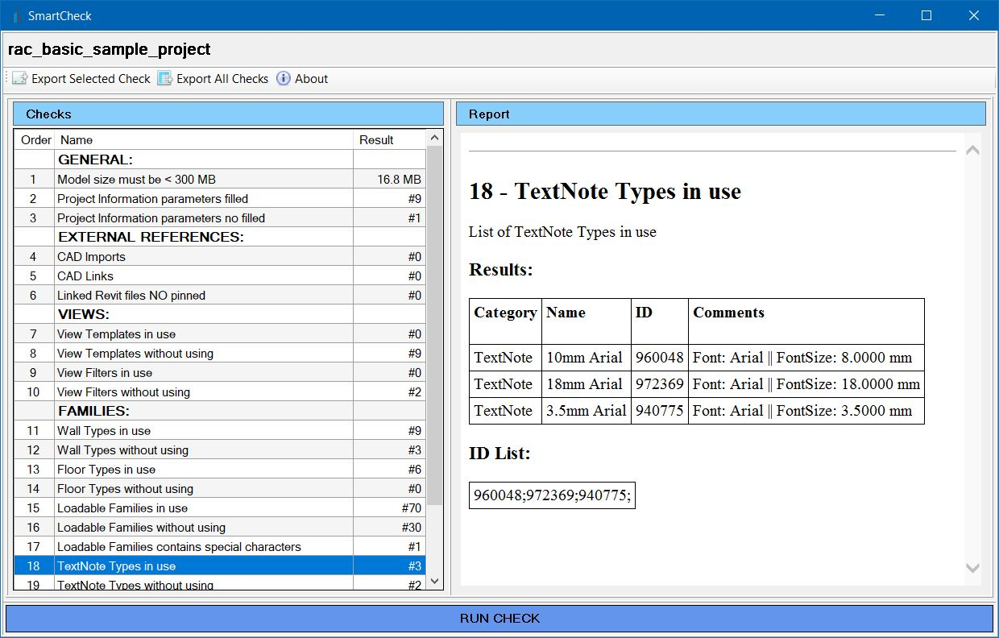

# SmartCheck for Revit

SmartCheck is a Revit addin that allows you to run a series of quality control tests on BIM models.

## Requirements
* Autodesk Revit 2018
* Autodesk Revit 2019
* Autodesk Revit 2020
* Autodesk Revit 2021

## Installer
You can download the latest version installer at this link
* https://github.com/gorovt/SmartCheck/releases
